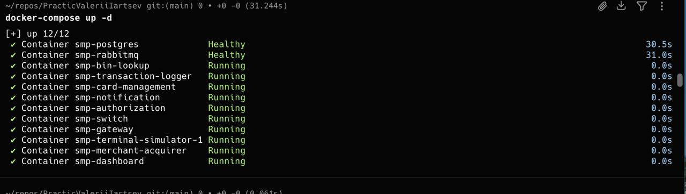
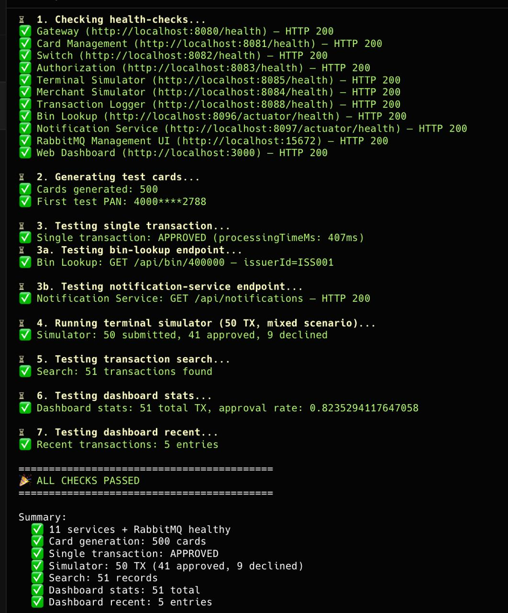
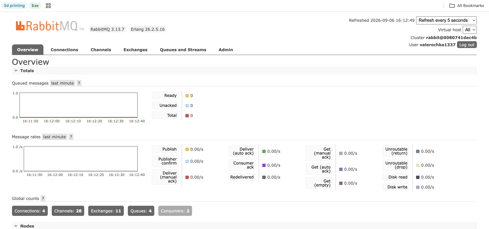
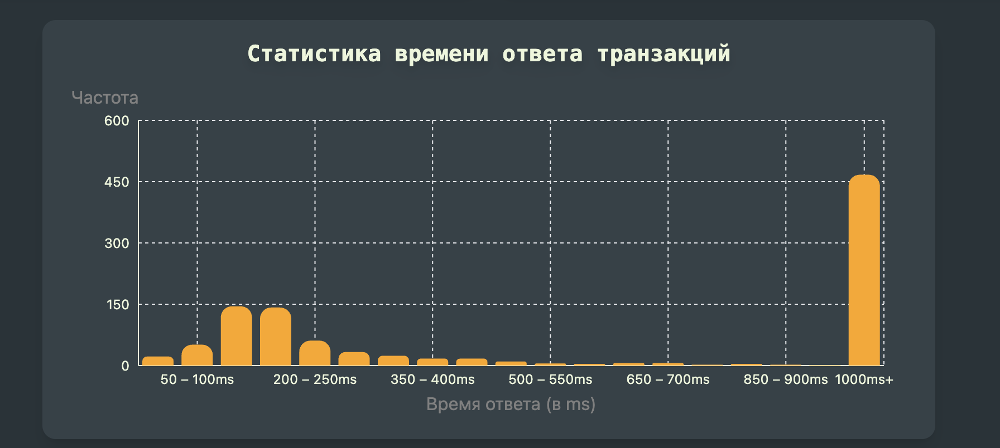

### рабит мку

### Курлы:

curl -X POST http://localhost:8080/api/cards/generate \
    -H "Content-Type: application/json" \
    -d '{
      "count": 100,
      "bins": ["400000", "400001", "400002", "400003", "400004"]
    }'

curl -X POST http://localhost:8080/api/simulator/terminal/run \
    -H "Content-Type: application/json" \
    -d '{
      "count": 1000,
      "scenario": "normal",
      "tps": 100
    }'

Видим, что транзакции сгенерились 